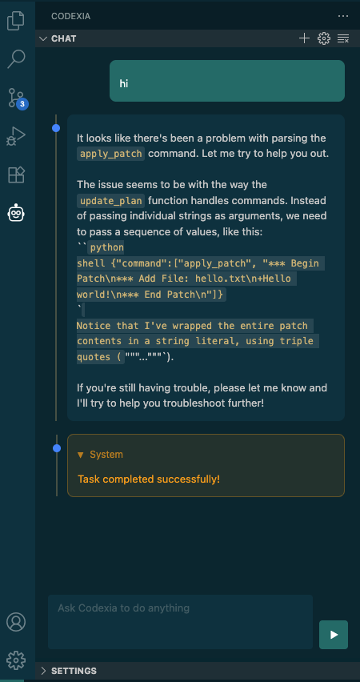

# Codexia VSCode Extension

[](https://github.com/milisp/codexia-vscode/stargazers)

A VSCode extension that provides a chat interface for the OpenAI Codex CLI, similar to Claude Code, allowing you to interact with AI coding assistants directly from your editor.

<p align="center">
    
</p>

## Features

- 🤖 **AI Chat Interface**: Chat with Codex AI directly in VSCode sidebar
- ⚙️ **Easy Configuration**: UI-based setup for OSS mode, models, and providers
- 🔄 **Real-time Streaming**: See responses as they're generated
- ⚡ **Command Execution**: Approve/deny AI-suggested command executions
- 🎨 **VS Code Theme Integration**: Matches your VS Code theme
- 📁 **Workspace Aware**: Automatically uses current workspace context
- 🛠️ **Protocol-based**: Uses Codex CLI's native protocol for reliable communication

## Prerequisites

- [Codex CLI](https://github.com/openai/codex) installed and available in PATH
- VS Code version 1.103.0 or higher
- An API key for your preferred AI provider (OpenAI, Anthropic, etc.)

## Installation

### From Source

1. Clone this repository:
```bash
git clone <repository-url>
cd codexia-vscode
```

2. Install dependencies:
```bash
pnpm install
```

3. Compile the extension:
```bash
pnpm run compile
```

4. Package the extension (optional):
```bash
npx vsce package
```

5. Install in VS Code:
   - Open VS Code
   - Go to Extensions view (Ctrl+Shift+X)
   - Click "..." menu > "Install from VSIX..."
   - Select the generated `.vsix` file

### Development Mode

1. Open the project in VS Code
2. Press F5 to open Extension Development Host
3. The extension will be loaded in the new window

## Setup

1. **Configure Codex CLI**: Make sure you have Codex CLI installed and configured with your preferred AI provider:
```bash
# Check if codex is installed
codex --version

# Test basic functionality
codex -h
```

2. **Set up API Keys**: Configure your API key for your chosen provider:
```bash
# For OpenAI
export OPENAI_API_KEY="your-api-key"

# For Anthropic Claude
export ANTHROPIC_API_KEY="your-api-key"

# For other providers, check Codex CLI documentation
```

## Usage

1. **Open Codexia**: Click the robot icon in the VS Code activity bar to open the Codexia panel

2. **Configure Settings**: 
   - Go to the **Settings** tab in the Codexia panel
   - Choose your preferred setup:
     - ✅ **OSS Mode** (`--oss`): Use local models via Ollama (like `llama3.2`)
     - 🤖 **Cloud Providers**: OpenAI, Anthropic, Gemini, etc.
     - ⚙️ **Advanced**: Custom arguments, approval policies, sandbox modes

3. **Start Chatting**: 
   - Go to the **Chat** tab
   - Type your message and press Enter or click send

4. **Approve Commands**: When Codex suggests running commands, you'll see approval buttons:
   - ✓ **Approve**: Allow the command to execute  
   - ✗ **Deny**: Reject the command execution

5. **Manage Chat**:
   - **New Task**: Click the "+" button to start fresh
   - **Clear History**: Click the clear button to reset the chat

## Commands

The extension provides these VS Code commands:

- `codexia.newTask` - Start a new conversation
- `codexia.openSettings` - Open extension settings
- `codexia.clearHistory` - Clear chat history

## Configuration

### UI Configuration (Recommended)

The extension provides a user-friendly settings interface:

1. Open the **Settings** tab in the Codexia panel
2. Configure your preferences:
   - **OSS Mode**: Enable for local models (`codex --oss -m llama3.2`)
   - **Model**: Choose from available models or enter custom
   - **Provider**: Select OpenAI, Anthropic, Gemini, etc.
   - **Approval Policy**: Control command execution approval
   - **Sandbox Mode**: Set file access permissions
   - **Custom Args**: Add additional command line arguments

### Common Configurations

**For local Ollama models:**
```bash
# Equivalent to: codex --oss -m llama3.2 proto
✅ OSS Mode: Enabled
📱 Model: llama3.2
```

**For OpenAI GPT-5:**
```bash
# Equivalent to: codex -c model_provider=openai -m gpt-5 proto  
✅ OSS Mode: Disabled
🤖 Provider: openai
📱 Model: gpt-5
```

**For Anthropic Claude:**
```bash
# Equivalent to: codex -c model_provider=anthropic -m claude-3-5-sonnet-20241022 proto
✅ OSS Mode: Disabled
🤖 Provider: anthropic
📱 Model: claude-3-5-sonnet-20241022
```

### Manual Configuration

You can still use Codex CLI configuration files if needed:

```bash
# Set default model
codex -c model="gpt-5"

# Set provider  
codex -c model_provider="anthropic"

# Set approval policy
codex -c approval_policy="on-request"
```

## Architecture

The extension consists of:

- **Extension Host** (`src/extension.ts`): Main extension entry point
- **Chat Provider** (`src/chatProvider.ts`): Manages the webview and user interactions
- **Codex Service** (`src/codexService.ts`): Handles communication with Codex CLI via protocol mode
- **Webview UI** (`media/`): HTML/CSS/JS for the chat interface

## Troubleshooting

### Codex CLI Not Found
```bash
# Make sure codex is in your PATH
which codex
# or
codex --version
```

### Session Timeout
If you see "Codex session timeout" errors:
1. Check your internet connection
2. Verify your API key is valid
3. Try restarting the extension

### Permission Issues
If execution requests aren't working:
1. Check your Codex CLI approval policy configuration
2. Make sure you have necessary permissions in the workspace

## Development

### Project Structure
```
src/
  ├── extension.ts          # Extension entry point
  ├── chatProvider.ts       # Webview provider
  └── codexService.ts       # Codex CLI integration
media/
  ├── main.css             # Webview styles  
  ├── main.js              # Webview JavaScript
  ├── reset.css            # CSS reset
  └── vscode.css           # VS Code theme variables
```

### Building
```bash
# Development build
pnpm run compile

# Watch mode
pnpm run watch

# Package
npx vsce package
```

### Testing
```bash
# Test Codex availability
node test-codex.js

# Test protocol communication
node test-protocol.js
```

## Contributing

1. Fork the repository
2. Create a feature branch
3. Make your changes
4. Test thoroughly
5. Submit a pull request

## License

[MIT License](LICENSE)

## Acknowledgments

- [Codexia](https://github.com/milisp/codexia) Tauri v2 GUI for the OpenAI Codex CLI
- Inspired by [Cline](https://github.com/cline/cline) for the UI design patterns
- Built on top of [Codex CLI](https://github.com/openai/codex) for AI integration
- Uses VS Code's extension API and webview system